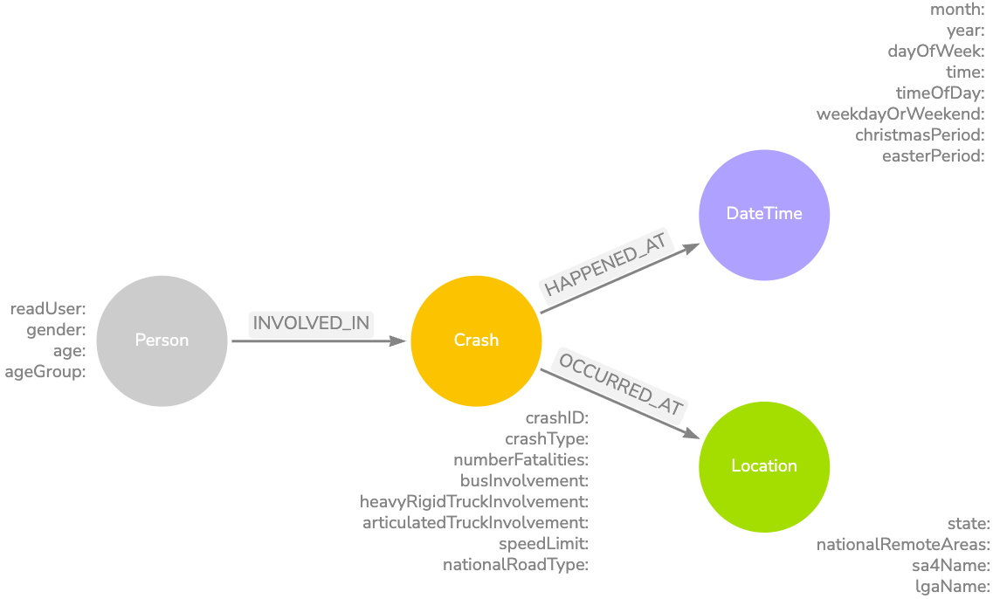
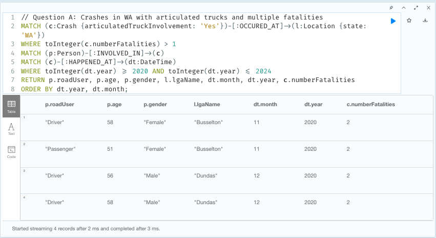

# CITS5504 Project 2: Graph Database Design and Cypher Query

**Contributor:** Laine Mulvay (22708032)

---

## Project Overview

This project explores the use of a property graph database (Neo4j) to model, analyse, and query Australian road crash data. The solution demonstrates the full ETL (Extract, Transform, Load) pipeline, graph data modelling, Cypher querying, and graph data science applications for road safety analysis.

<div style="text-align: center;">
  
</div>

*Graph Database Design (Arrows.app)*

---

## Getting Started

### 1. Clone the Repository

```bash
git clone https://github.com/yourusername/CITS5504-Project-2.git
cd CITS5504-Project-2
```

### 2. Neo4j Setup

1. **Open Neo4j Desktop** (or use Neo4j Aura if you cannot install locally).
2. **Create Project from Directory:**  
   Select this repository (`CITS5504-Project-2`) as your project directory.
3. **Add a New Local DBMS** and start the database.
4. **Open with Neo4j Browser.**
5. **Import Data:**
   - Open the import folder in Neo4j.
   - Add CSV files from `/data/neo4j_import` one by one.

<div style="text-align: center;">
  
</div>

*Creating Crash nodes from CSV in Neo4j*

---

## ETL Process

- **Extract:** Raw data is cleaned and stored in `/data/raw/Project2_Dataset_Corrected.csv`.
- **Transform:** Python script [`scripts/ETL.py`](scripts/ETL.py) processes the data into node and relationship CSVs.
- **Load:** Use Cypher scripts in [`scripts/scripts.txt`](scripts/scripts.txt) to create constraints, import nodes and relationships, and create indexes in Neo4j.

---

## Querying and Analysis

- All Cypher queries for required and additional analyses are provided in [`scripts/scripts.txt`](scripts/scripts.txt).
- Example query result:

<div style="text-align: center;">
  
</div>

*Results showing crashes in WA with articulated trucks and multiple fatalities*

---

## Graph Data Science

- The project demonstrates the use of Breadth-First Search (BFS) and other graph algorithms for path analysis and road safety insights.

<div style="text-align: center;">
  
</div>

*Path analysis showing connections between LGAs using BFS*

---

## Report

- The full project report is available in [`report/Report.md`](report/Report.md) and includes detailed methodology, code snippets, screenshots, and analysis.

---

## Contributor

- **Laine Mulvay**  
  [GitHub Profile](https://github.com/lainos123)  
  UWA Student ID: 22708032

---

## License

This project is for academic purposes as part of CITS5504 at UWA.

---

## Acknowledgements

- Neo4j Community and Documentation
- UWA CITS5504 Teaching Staff