# CITS5504 Project 2: Graph Database Design and Cypher Query
## *Laine Mulvay (22708032)*


## 1. Design and Implementation Process

## 1.1 Graph Data Modelling Approach

Our graph database follows the property graph model, providing an optimal structure for representing road crash data relationships. We employed four key node types with specific design rationales:

## Node Selection Rationale and Critical Evaluation

1. **Crash Nodes**
   - **Design Choice**: Central hub in our graph model
   - **Implementation**: Based on 'Crash ID' with crash-specific attributes such as crash type, number of fatalities, vehicle involvements, speed limit and road type.
   - **Strengths**: 
     - Effectively centralises multiple vehicle/person involvements in a single incident
     - Matches the source data structure where crashes are the primary events
   - **Limitations**: 
     - Creates a strict star topology that makes direct child-child node paths impossible
     - Introduces an unavoidable additional hop over the crash nodes in path traversals

2. **Person Nodes**
   - **Design Choice**: Independent nodes with one or more per crash
   - **Implementation**: Using original 'ID' as personId (IDs are unique to people in the original data)
   - **Strengths**: 
     - Preserves the 1:1 relationship in our source data between person and crash
     - Supports demographic filtering (e.g., crashes involving young male drivers)
   - **Limitations**: 
     - Limited value in our model because the source data only captures one crash per person, preventing analysis of repeat crash involvement.

3. **Location Nodes**
   - **Design Choice**: Composite nodes capturing geographic hierarchy
   - **Implementation**: Combined state, remoteness, SA4 and LGA identifiers
   - **Strengths**: 
     - Unique to LGA's
     - Allows filtering by various geographic levels (state vs. local)
   - **Limitations**: 
     - **Path queries between LGAs require minimum 4 hops** (LGA1→Crash1→Datetime→Crash2→LGA2), making Question F impossible as specified
     - Composite keys created implementation complexity in our ETL process

4. **DateTime Nodes**
   - **Design Choice**: Separate temporal dimension nodes
   - **Implementation**: Composite time identifiers from month, year, time and various time period catagorical properties
   - **Strengths**: 
     - Supports time-based analysis (particularly useful for holiday period and time of day analysis)
     - Efficiently represents recurring temporal patterns in Australian crash data
     - Allows our graphs to be conencted via DateTime as well as LGA
   - **Limitations**: 
     - DateTime nodes are not fully unique - they are only unique based on the combination of Month, Year, and Time. This means that crashes occurring at the same time on different days within the same month and year will share the same DateTime node. This limitation stems from the source data not including the day of month, which would enable complete uniqueness. While including Dayweek would increase query granularity, it still would not make these nodes fully unique to a specific date and time.
     - Adds another traversal hop in multi-dimensional queries

## 1.2 Relationship Design

Our relationships reflect natural connections in the domain:

- **INVOLVED_IN**: Person → Crash (based on 'Crash ID' linking to person records)
- **OCCURRED_AT**: Crash → Location (using composite location identifier - unique LGA's)
- **HAPPENED_AT**: Crash → DateTime (using composite datetime identifier)

This structure optimises both traversal performance and query flexibility, particularly for pattern-matching and path-finding operations that would be cumbersome in relational databases.

## 1.3 Graph Design Visualisation

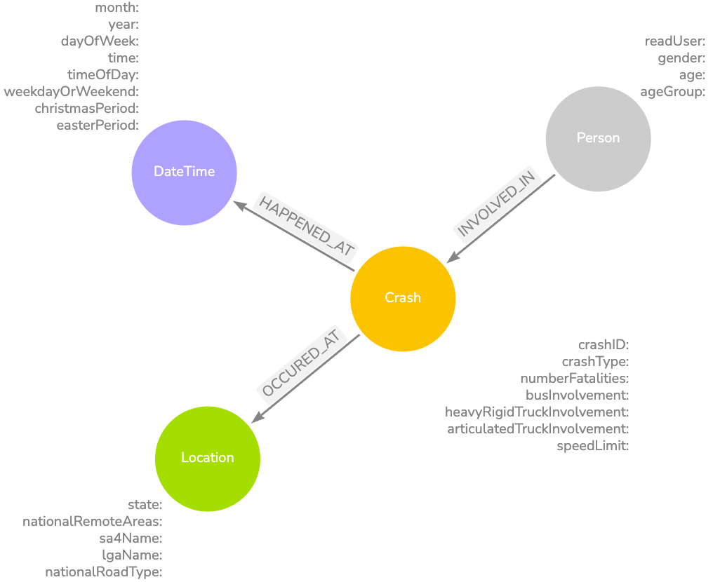
*Figure 1: Graph Database Design created using Arrows.app*

The implemented design balances normalisation with query performance, following Neo4j best practices for domain-driven design while maintaining the contextual integrity of the Australian road crash data.


\newpage

## 2. ETL Process

## 2.1 Extract
The initial data was extracted from the ARDD: Fatalities—December 2024—XLSX dataset, which was processed to remove all missing/unknown values, modify existing values, and add new columns. The cleaned dataset was stored in `/data/raw/Project2_Dataset_Corrected.csv` and contains 10,490 records (excluding the header row) with 25 columns of crash-related information.

**Note on Data Filtering**: 
While the project guidelines suggested that filtering might be necessary for performance reasons ("If you experience long query time, consider reducing the dataset size by filtering out records, such as deleting records for specific State/Year"), we found that our implementation was able to handle the full dataset efficiently. This was achieved through:
1. Proper indexing of frequently queried properties
2. Optimised node and relationship creation
3. Efficient query design

Therefore, no filtering was performed on the dataset, and we maintained all 10,490 records for our analysis. This ensures that our results represent the complete dataset without any data loss or bias that might have been introduced through filtering.

## 2.2 Transform
The transformation process was implemented using Python ([ETL.py](../scripts/ETL.py)), focusing on converting the raw CSV data into a graph structure that matches our Arrows design. The process involves several key steps:

1. **Data Preparation and Unique ID Creation**:
```python
# Create unique IDs for nodes
df['personId'] = df['ID'].astype(str)  # Using the original ID as personId
df['locationId'] = df['State'] + '_' + df['National Remoteness Areas'] + '_' + df['SA4 Name 2021'] + '_' + df['National LGA Name 2024']
df['dateTimeId'] = df['Month'].astype(str) + '_' + df['Year'].astype(str) + '_' + df['Time']
```
These unique IDs are crucial for maintaining data integrity and establishing relationships between nodes.

2. **Node Creation**:
The script creates separate dataframes for each node type defined in our graph design:
*Note we change to camelCase for the node Properties*

```python
# Person nodes
person_df = df[['personId', 'Road User', 'Gender', 'Age', 'Age Group', 'Crash ID']].copy()
person_df.columns = ['personId', 'roadUser', 'gender', 'age', 'ageGroup', 'crashId']

# Crash nodes
crash_df = df[['Crash ID', 'Crash Type', 'Number Fatalities', 'Bus Involvement', 
               'Heavy Rigid Truck Involvement', 'Articulated Truck Involvement', 
               'Speed Limit', 'National Road Type']].copy()
crash_df.columns = ['crashId', 'crashType', 'numberFatalities', 'busInvolvement', 
                    'heavyRigidTruckInvolvement', 'articulatedTruckInvolvement', 
                    'speedLimit', 'nationalRoadType']

# Location nodes
location_df = df[['locationId', 'State', 'National Remoteness Areas', 'SA4 Name 2021', 
                  'National LGA Name 2024', 'Crash ID']].copy()
location_df.columns = ['locationId', 'state', 'nationalRemoteAreas', 'sa4Name', 
                       'lgaName', 'crashId']

# DateTime nodes
dateTime_df = df[['dateTimeId', 'Month', 'Year', 'Dayweek', 'Time', 'Time of day', 
                  'Day of week', 'Christmas Period', 'Easter Period', 'Crash ID']].copy()
dateTime_df.columns = ['dateTimeId', 'month', 'year', 'dayOfWeek', 'time', 'timeOfDay', 
                      'weekdayOrWeekend', 'christmasPeriod', 'easterPeriod', 'crashId']
```

3. **Duplicate Removal**:
Since we're creating distinct node labels in our graph database, we need to ensure each node represents a unique entity. For example, a location node should represent a unique LGA (Local Government Area) rather than being duplicated for each crash that occurred there. Therefore, we remove duplicates based on our unique identifiers:
```python
# Remove duplicates to ensure unique nodes
crash_df = crash_df.drop_duplicates(subset=['crashId'])
location_df = location_df.drop_duplicates(subset=['locationId'])
dateTime_df = dateTime_df.drop_duplicates(subset=['dateTimeId'])
```

4. **Relationship Preparation**:
The script prepares relationship dataframes that will be used to create connections between nodes based on the ids we previously created:
```python
# For INVOLVED_IN relationship - Person to Crash
person_crash_rel = person_df[['personId', 'crashId']].copy()

# For OCCURED_AT relationship - Crash to Location
crash_location_rel = df[['Crash ID', 'locationId']].copy()
crash_location_rel.columns = ['crashId', 'locationId']
crash_location_rel = crash_location_rel.drop_duplicates()

# For HAPPENED_AT relationship - Crash to DateTime
crash_dateTime_rel = df[['Crash ID', 'dateTimeId']].copy()
crash_dateTime_rel.columns = ['crashId', 'dateTimeId']
crash_dateTime_rel = crash_dateTime_rel.drop_duplicates()
```
The script prepares relationship dataframes that will be used to create connections between nodes based on the ids we previously created. For example, if a crash with ID "12345678" resulted in 2 fatalities, it would appear twice in our raw data (once for each fatality). However, we only want one HAPPENED_AT relationship between this crash and its datetime, and one OCCURED_AT relationship between this crash and its location. Therefore, we drop duplicates to ensure each crash has exactly one relationship to its location and datetime:


5. **CSV Export**:
Finally, the transformed data is exported to CSV files that will be used in the Neo4j import process:
```python
# Export node CSVs
person_df.to_csv(f"{output_dir}/person_nodes.csv", index=False)
crash_df.to_csv(f"{output_dir}/crash_nodes.csv", index=False)
location_df.to_csv(f"{output_dir}/location_nodes.csv", index=False)
dateTime_df.to_csv(f"{output_dir}/dateTime_nodes.csv", index=False)

# Export relationship CSVs
person_crash_rel.to_csv(f"{output_dir}/person_crash_rel.csv", index=False)
crash_location_rel.to_csv(f"{output_dir}/crash_location_rel.csv", index=False)
crash_dateTime_rel.to_csv(f"{output_dir}/crash_dateTime_rel.csv", index=False)
```

This transformation process ensures that:

- Each node type has appropriate properties as defined in our graph design
- Relationships between nodes are properly established
- Data integrity is maintained through unique identifiers
- The structure matches our Arrows design visualisation
- The data is ready for import into Neo4j

## 2.3 Load
The load process involved setting up the Neo4j database and importing the transformed data. This required several steps:

1. **Database Setup**:
   - Create a new project in Neo4j Desktop
   - Add a new local DBMS
   - Start the database
   - Open Neo4j Browser

2. **File Import**:
   - Open the import folder in Neo4j
   - Add CSV files from `/data/neo4j_import` one by one

3. **Database Initialisation**:
   The following steps were performed in the Neo4j Browser to set up the database structure:

> **Note:** The complete Cypher load queries for all node, relationship, and index creation steps are provided in the first half of [`/scripts/scripts.txt`](../scripts/scripts.txt).

### 2.3.1 Constraints

Constraints are essential for maintaining data integrity in the graph database. They ensure that each node has a unique identifier, preventing duplicate nodes and maintaining the accuracy of relationships between entities.

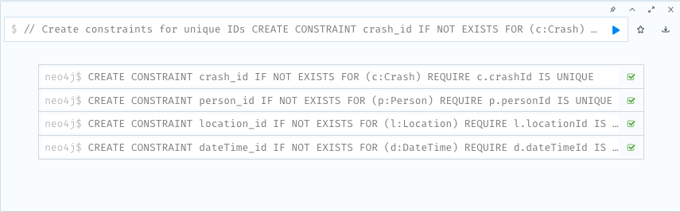
*Figure 2: Creating unique constraints for node identifiers in Neo4j*

### 2.3.2 Node Creation

This node creation process:
1. Loads data from the `crash_nodes.csv` file that was added to the Neo4j import 
folder
2. Creates Crash nodes with properties matching our graph design
3. Converts numeric values using `toInteger()` function
4. Establishes the foundation for relationships with other nodes

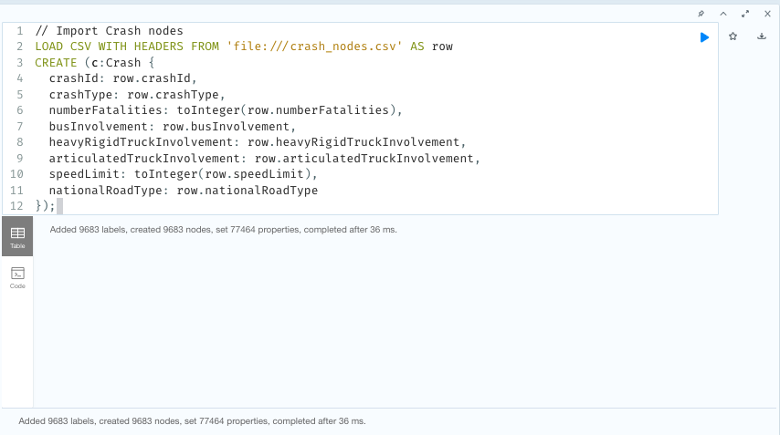
*Figure 3: Creating Crash nodes from CSV in Neo4j*

Similar LOAD CSV commands were executed for other node types (Person, Location, 
DateTime), following the same pattern of loading from their respective CSV files 
in the import folder.

### 2.3.3 Relationship Creation

This relationship creation process:

1. Loads relationship data from the `person_crash_rel.csv` file
2. Matches existing Person and Crash nodes using their unique identifiers
3. Creates the INVOLVED_IN relationship between matched nodes
4. Establishes the connection between people and the crashes they were involved in

Relationships (such as `INVOLVED_IN`, `OCCURRED_AT`, and `HAPPENED_AT`) were created by loading relationship CSVs and matching nodes by their unique identifiers.

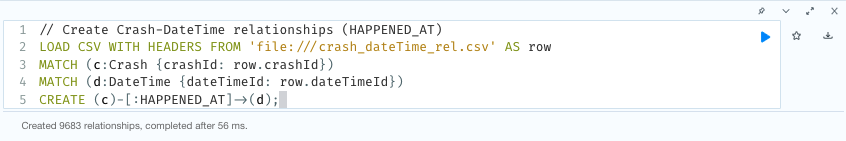
*Figure 4: Creating relationships between nodes in Neo4j*


### 2.3.4 Index Creation

Indexes are crucial for query performance optimisation. They work by creating a sorted data structure for frequently queried properties, enabling faster lookups when filtering or matching on these properties. For example:

- The `crash_speed_idx` index optimises queries that filter crashes by speed limit
- The `location_state_idx` index speeds up queries that search for crashes in specific states
- The `person_age_group_idx` index improves performance when analysing crashes by age groups

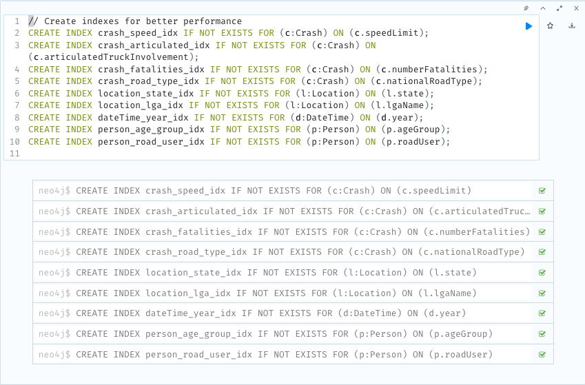
*Figure 5: Creating indexes in Neo4j*

These indexes are particularly important for our query requirements, such as:

- Finding crashes in specific states (using `location_state_idx`)
- Analysing crashes by age groups (using `person_age_group_idx`)
- Filtering crashes by speed limits (using `crash_speed_idx`)
- Identifying crashes involving specific vehicle types (using `crash_articulated_idx`)

\newpage

## 2.4 Database Summary After ETL

After completing the ETL and load process, we verified the database structure and content using Neo4j's built-in information commands. The following screenshot summarises the resulting graph:


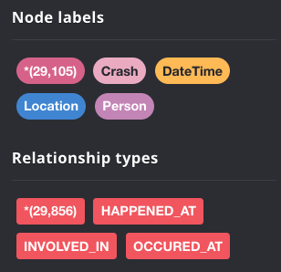{ width=40% } \newline
*Figure 6: Overview of the graph database after ETL and load, showing the number of nodes, relationships, labels, and relationship types.*

This confirms that the data was successfully imported and the graph structure matches our intended design, with all node types, relationships, and properties correctly established.

\newpage

## 3. Query Implementation and Results

The full research questions can be found in the [Task Sheet](https://csse-uwa.gitbook.io/data-warehouse-project-2-s1-2025). The complete Cypher queries for all questions can be found in the second half of  `/scripts/scripts.txt`.

## 3.1 Required Queries
We implemented all required queries (A-G) with optimisations for performance. Here are the results:

1. **Question A**: WA crashes with articulated trucks and multiple fatalities

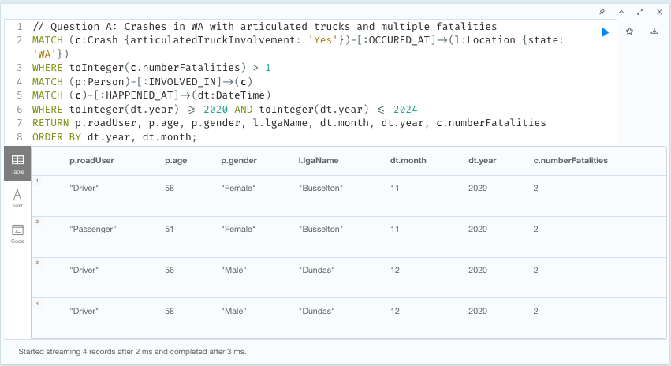
*Figure 7: Results showing crashes in WA with articulated trucks and multiple fatalities*

\newpage

2. **Question B**: Motorcycle rider age ranges during holidays

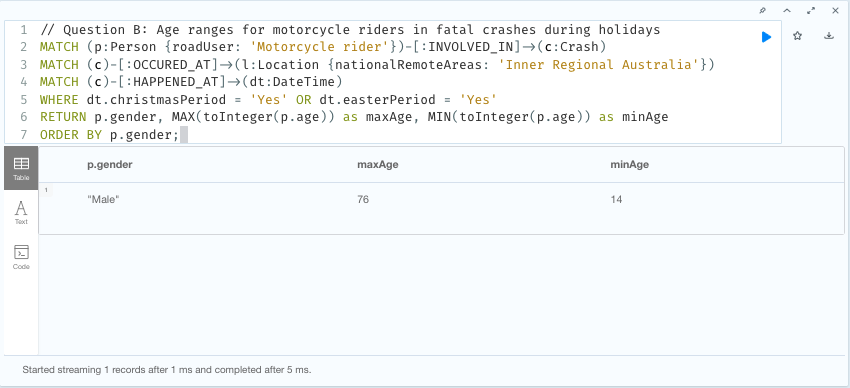
*Figure 8: Age ranges for motorcycle riders in fatal crashes during holidays*

3. **Question C**: Young drivers in fatal crashes on weekends vs. weekdays

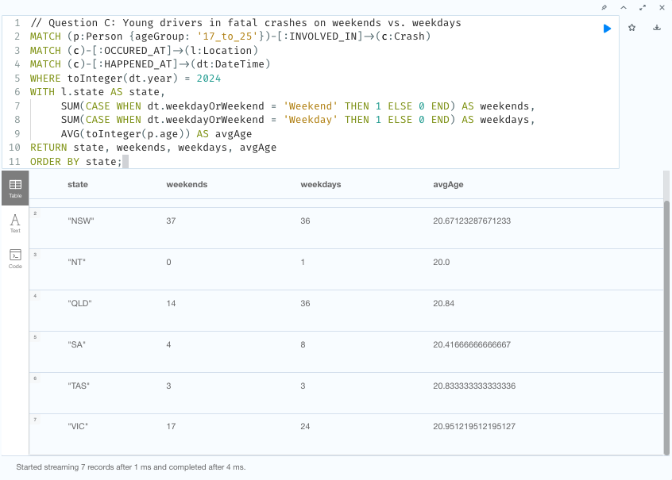
*Figure 9: Analysis of young drivers involved in fatal crashes by state and day type*

4. **Question D**: Friday crashes in WA with multiple deaths and mixed gender victims

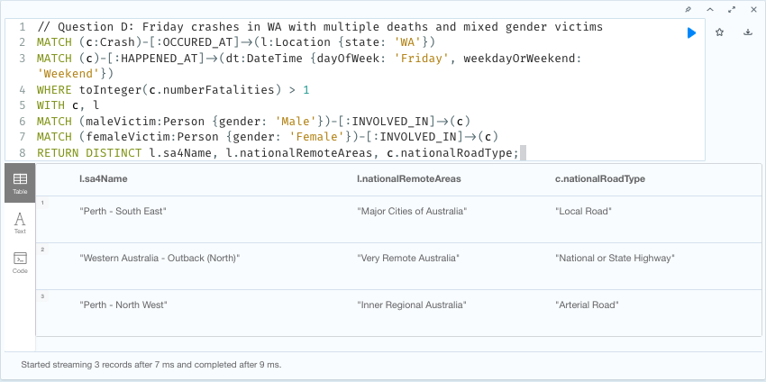
*Figure 10: Results showing Friday crashes in WA with multiple fatalities and mixed gender victims*

5. **Question E**: Top 5 SA4 regions with fatal crashes during peak hours

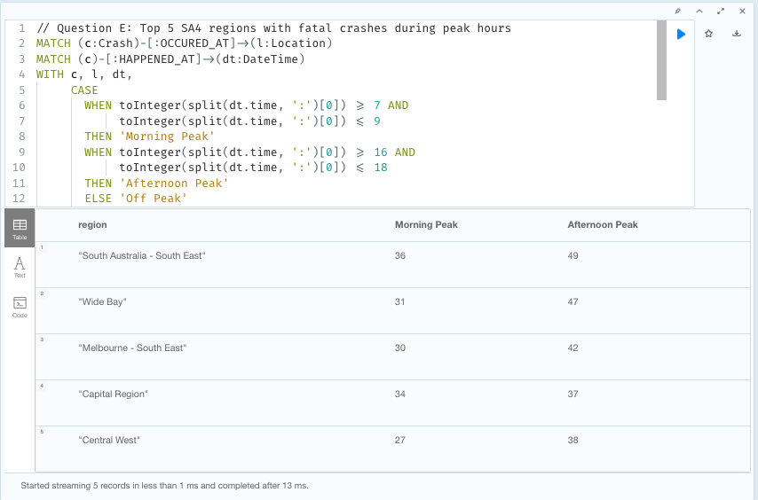
*Figure 11: Analysis of fatal crashes during peak hours across SA4 regions*
*Note: For the complete query, please refer to the full code in Scripts.txt*

6. **Question F**: Paths of length 3 between LGAs

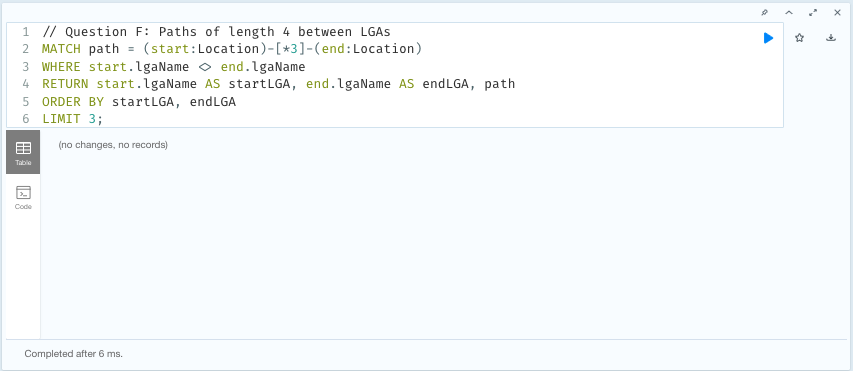
*Figure 12: Path analysis showing connections between different LGAs*
The query returns no results, which aligns with our graph design shown in Figure 1. This outcome is expected because our current implementation only connects locations (LGAs) to crashes, and crashes themselves are not interconnected. Therefore, it's impossible to find a path of length 3 between any two location nodes.

To enable this type of query, we would need to modify our graph structure. A potential solution would be to introduce a state node that connects to both crashes and LGAs. This would create a path of length 3 between LGAs through the state and crash nodes.

Given the interesting nature of this limitation, we explore an alternative approach using path length 4 in Section 4: Graph Data Science Application.

\newpage

7. **Question G**: Weekday fatal crashes involving pedestrians

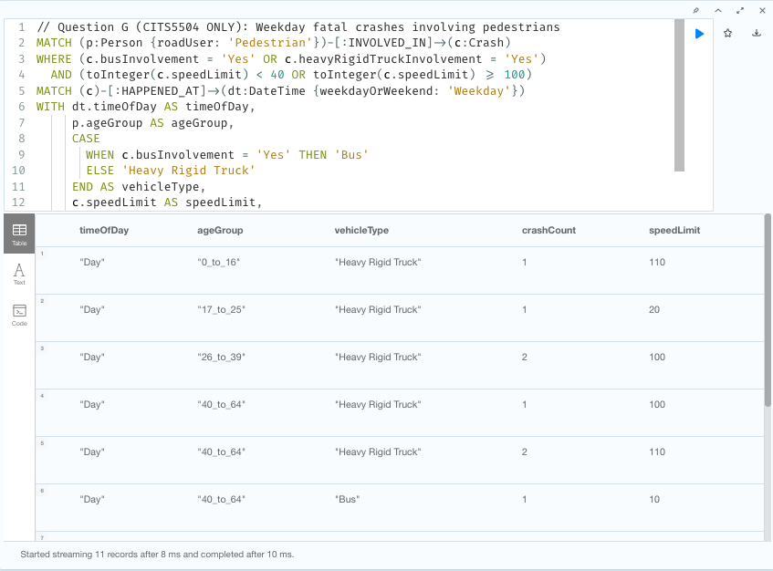
*Figure 13: Analysis of weekday fatal crashes involving pedestrians with specific vehicle types and speed limits*
*Note: For the complete query, please refer to the full code in Scripts.txt*

Key findings from these queries include:

- The distribution of crashes across different regions and time periods
- Patterns in crash severity and vehicle involvement
- Demographic trends in crash victims
- Geographical relationships between crash locations
- Impact of time and road conditions on crash frequency

\newpage

## 3.2 Additional Meaningful Queries
We implemented three additional meaningful queries to gain deeper insights into the crash data:

1. **Elderly Driver Analysis**

Research Question: "What are the most dangerous times of day for elderly drivers (aged 65 and above) in urban versus rural areas, and how does this vary by location type?"

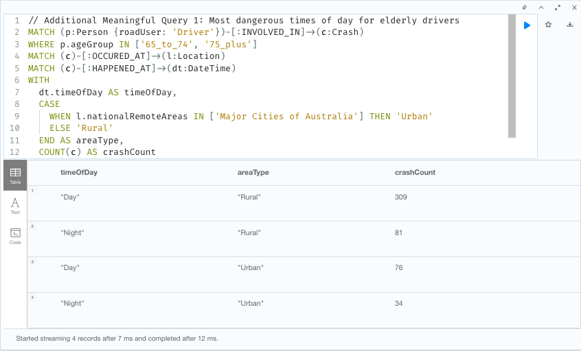
*Figure 14: Analysis of crash patterns for elderly drivers in urban vs rural areas*
*Note: For the complete query, please refer to the full code in Scripts.txt*

\newpage

2. **Speed Limit Impact Analysis**

Research Question: "How do different speed limits affect fatality rates across various types of road users, and what patterns emerge in the relationship between speed limits and crash severity?"

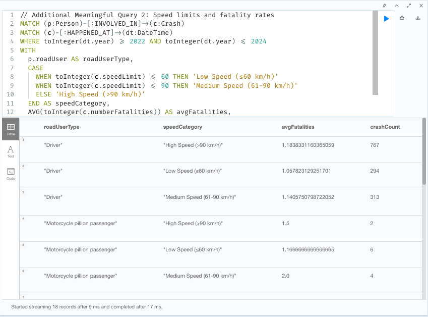
*Figure 15: Analysis of fatality rates across different speed limits and road user types*
*Note: For the complete query, please refer to the full code in Scripts.txt*

\newpage

3. **Age Group and Road Conditions Analysis**

Research Question: "How do different age groups experience crashes across various road types and conditions, and what patterns emerge in the relationship between age, crash type, and time of day?"

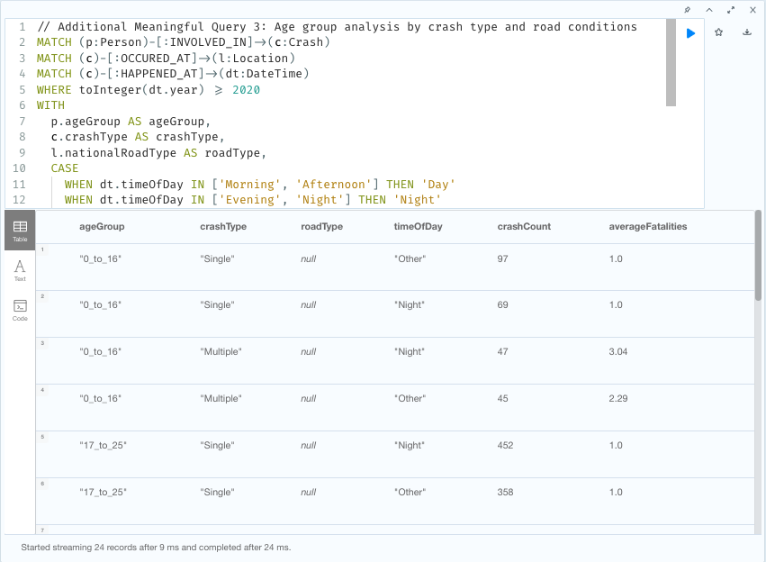
*Figure 16: Analysis of crash patterns across different age groups, road types, and times of day*
*Note: For the complete query, please refer to the full code in Scripts.txt*

\newpage

## 4. Graph Data Science Application

## 4.1 Path Analysis with Breadth-First Search (BFS)

Graph Data Science (GDS) enables the discovery of complex patterns within graph-structured data that would be difficult to find using traditional relational approaches. In our project, we applied BFS to analyse connections between different Australian LGAs through crash incidents.

**BFS Implementation in Our Graph Structure**

BFS is particularly well-suited for finding the shortest path between nodes in an unweighted graph. In our Neo4j implementation, BFS powers the path-finding queries that connect LGAs:

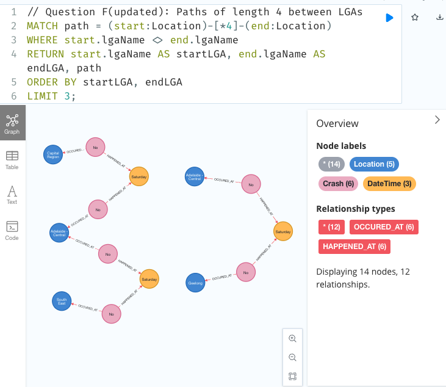{ width=70% }

*Figure 17: Path analysis showing Location → Crash → DateTime → Crash → Location traversal pattern. This demonstrates how crashes at the same time connect different locations, without involving Person nodes (which are unique to each crash).*


This query systematically explores paths of exactly 4 relationships between Location nodes, revealing how different LGAs are connected through the crash network. The connections occur via DateTime nodes, which are not unique in our data model.

This non-uniqueness of DateTime nodes is actually crucial - if we had made DateTime nodes unique, LGAs would not be connected at all, resulting in an unconnected graph. Our graph structure enforces a minimum path length of 4 between LGAs, which explains why Query F (finding paths of length 3) returned no results.

The traversal follows the pattern: LGA1 → Crash1 → DateTime → Crash2 → LGA2. This pattern reveals how crashes occurring at the same time, in the same month and year, connect different geographic areas, exposing temporal-spatial crash patterns across location boundaries.

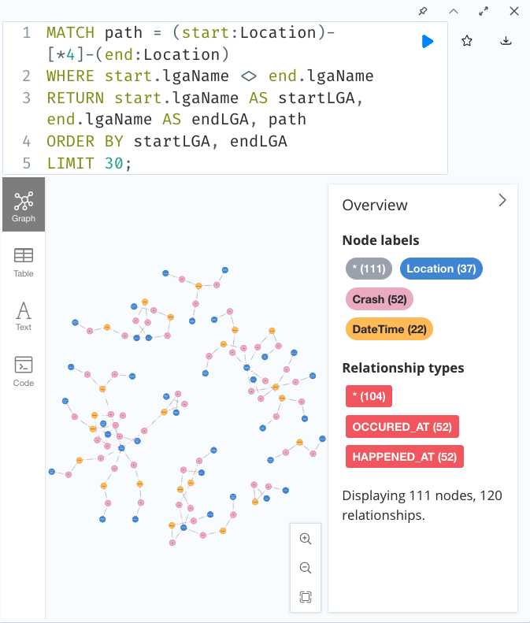
*Figure 18: Extended path analysis revealing 30 connections between LGAs. This shows several disconnected clusters, with the largest spanning 35 nodes and the smallest containing just 5 nodes.*

As we return more results, we can see how the DateTime node is key to creating connected components in our grpah


## 4.2 Real-World Applications of BFS in Road Safety

Applying BFS to our road crash graph model enables several practical insights for transport authorities:

- **Crash Cluster Identification:**  
  BFS reveals geographic clusters of crashes that span multiple LGAs, identifying "crash corridors" that require coordinated intervention across jurisdictions.

- **Road Safety Network Analysis:**  
  By exploring connected LGAs, BFS highlights thoroughfares with higher risk profiles that cross location boundaries.

- **Comparative Crash Pattern Analysis:**  
  Path analysis between LGAs helps detect similar crash patterns across different regions, informing targeted safety measures where similar risk factors exist.

- **Transport Corridor Risk Assessment:**  
  BFS traces patterns of connected crashes along transport corridors, showing how risk factors propagate across regional boundaries and supporting proactive resource allocation.

## 4.3 Other Relevant Graph Algorithms

While BFS was our primary algorithm, several other graph algorithms could provide valuable insights into our road crash data:

- **Depth-First Search (DFS):** 
  Could be used to explore crash patterns in depth within specific regions. This would be particularly useful for analysing crash chains within a single LGA, where we want to understand the full context of location-related incidents before moving to other regions (Cormen et al., 2022).

- **A-Star Algorithm:**
  With appropriate heuristics based on crash severity, frequency, road conditions, traffic volume, and historical accident data, A* could find optimal paths between LGAs that minimise risk factors. This would be valuable for identifying the most dangerous routes between locations and could incorporate real-time data like weather conditions and traffic congestion (Hart et al., 1968).

- **Travelling Salesman Problem (TSP):**
  With modifications to consider crash severity as "costs," TSP algorithms could help optimise routes for safety inspectors or emergency response teams, ensuring they visit high-risk areas efficiently (Applegate et al., 2006).

These algorithms could be implemented using Neo4j's Graph Data Science library, which provides optimised implementations for many of these approaches.

## References

Applegate, D. L., Bixby, R. E., Chvátal, V., & Cook, W. J. (2006). The travelling salesman problem: A computational study. Princeton University Press.


Hart, P. E., Nilsson, N. J., & Raphael, B. (1968). A formal basis for the heuristic determination of minimum cost paths. IEEE Transactions on Systems Science and Cybernetics, 4(2), 100-107.


